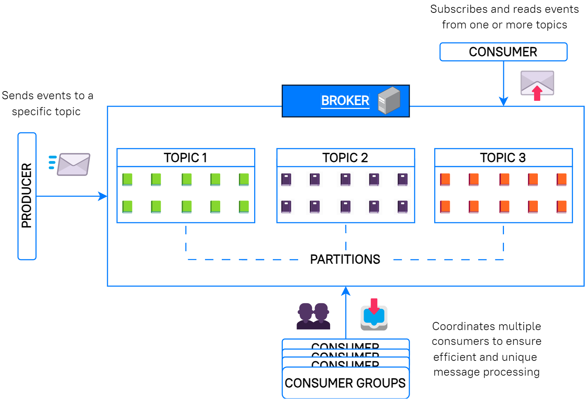

# Система уведомлений в реальном времени на Go и Kafka

Cистема уведомлений в реальном времени, созданная с помощью Go и Apache Kafka. Этот проект демонстрирует интеграцию возможностей потоковой передачи событий Kafka с Go для создания базовой системы уведомлений.

## Основные компоненты Kafka ⚙️
- `Kafka Brokers`: Сервер, на котором работает программное обеспечение Kafka и хранятся данные. Хотя в крупномасштабных производственных системах часто используется несколько брокеров на нескольких машинах, в этом проекте я использовал один брокер

- `Topics`: Kafka похожи на папки в файловой системе. Они представляют собой категории, в которых хранятся данные или события. Например, название темы может быть таким: **"notifications"**

- `Producers`: Cущности, которые публикуют (записывают) или отправляют сообщения в Kafka, например программа на Go или сервис. Когда производителю нужно отправить событие, он выбирает тему для его отправки

- `Consumers`: Потребители считывают и обрабатывают события или сообщения из Kafka. После того как производители отправляют сообщения в темы, потребители могут подписаться на одну или несколько тем, чтобы получать сообщения

- `Partitions`: Каждый **Topic** в Kafka может быть дополнительно разделена на разделы. Разделы можно рассматривать как сегменты внутри **Topic**, которые позволяют Kafka более эффективно управлять данными, особенно в системах с несколькими брокерами

- `Consumer groups`: В то время как отдельные потребители обрабатывают сообщения из конкретных разделов, группы потребителей управляют координацией между несколькими потребителями.Группа потребителей состоит из нескольких потребителей, совместно обрабатывающих сообщения из разных разделов темы. Это гарантирует, что каждое сообщение из раздела будет обработано только одним потребителем в группе, что обеспечивает эффективное и масштабируемое потребление.Представьте себе команду потребителей, работающих вместе, где каждый участник отвечает за сообщения из определённых разделов, следя за тем, чтобы ни одно сообщение не было пропущено

## Kafka Architecture


## Быстрый старт

### 1. Запуск Kafka
```bash
docker-compose up -d
```

### 2. Установка зависимостей
```bash
go mod tidy
```

### 3. Запуск миграций
```bash
task migrate
```

### 4. Запуск Producer
```bash
task producer
```

### 5. Запуск Consumer
```bash
task consumer
```

## Отправка уведомлений 
### Пользователь 1 (Эмма) получает уведомление от пользователя 2 (Бруно)
```bash
curl -X POST http://localhost:8080/send \
-d "from_id=2&to_id=1&message=Bruno started following you."
```

### Пользователь 2 (Бруно) получает уведомление от пользователя 1 (Эммы):
```bash
curl -X POST http://localhost:8080/send \
-d "from_id=1&to_id=2&message=Emma mentioned you in a comment: 'Great seeing you yesterday, @Bruno!'"
```

### Пользователь 1 (Эмма) получает уведомление от пользователя 4 (Лены):
```bash
curl -X POST http://localhost:8080/send \
-d "from_id=4&to_id=1&message=Lena liked your post: 'My weekend getaway!'"
```

## Получение уведомлений
Мы можем получить уведомления от конкретного пользователя. Для получения уведомлений вы можете использовать следующие curl команды

### Получение уведомлений для пользователя 1 (Эмма):
```bash
curl http://localhost:8081/notifications/1
```

### Получаем:
```json
{"notifications": [{"from": {"id": 2, "name": "Bruno"}, "to": {"id": 1, "name": "Emma"}, "message": "Bruno started following you."}]}
{"notifications": [{"from": {"id": 4, "name": "Lena"}, "to": {"id": 1, "name": "Emma"}, "message": "Lena liked your post: 'My weekend getaway!'"}]}
```